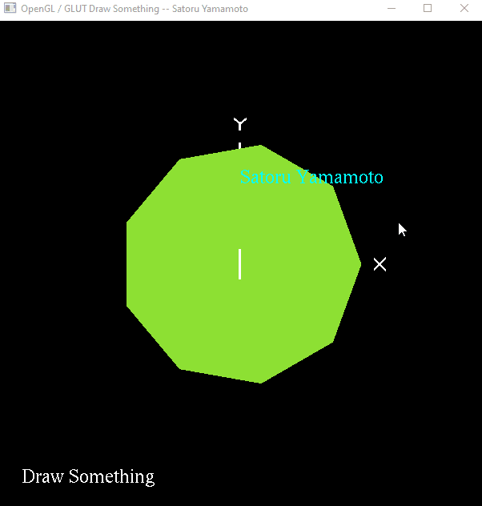
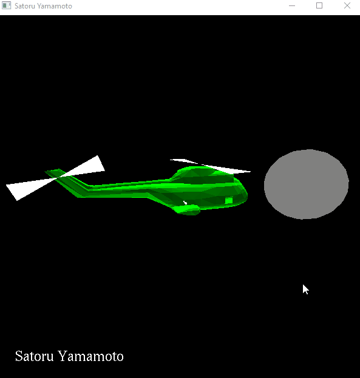
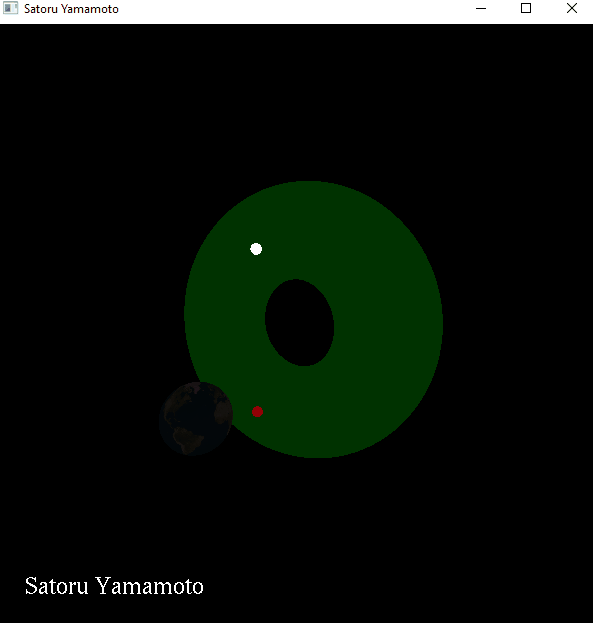
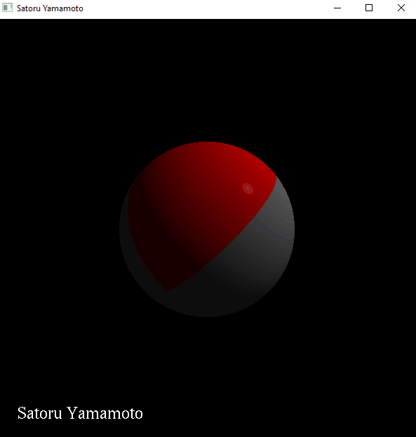
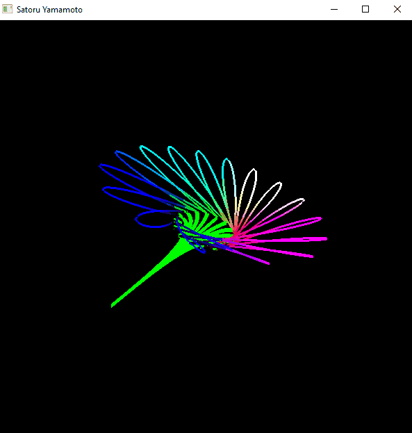

## Contact info

E-mail: yamamsat@oregonstate.edu 
Discord: satoru#2984

# Computer Graphics
Repository for learning Computer Graphics in C++. Each file includes description of code and gif animation.

# Topics:
* Summary of the computer graphics process
* Coordinate systems and the graphics pipeline
* Drawing a 3D scene using OpenGL
* Single and hierarchical transformations
* Projection from 3D to 2D
* Altering the 3D viewing
* Framebuffers and color
* Lighting
* Texture mapping
* Transparency (blending)
* Various approaches to 3D modeling
* Various approaches to 3D rendering
* Vertex Buffer Objects
* GLM
* Shaders (Vertex and Fragment)
* A brief look into the future -- Vulkan

# Gif Animations

  
Draw Something

  

  
Animate Helicopter

  

  
Texture Mapping

  

  
Lighting

  

  
Shaders

  

  
Geometric Modeling

  

  
Solar System

  

